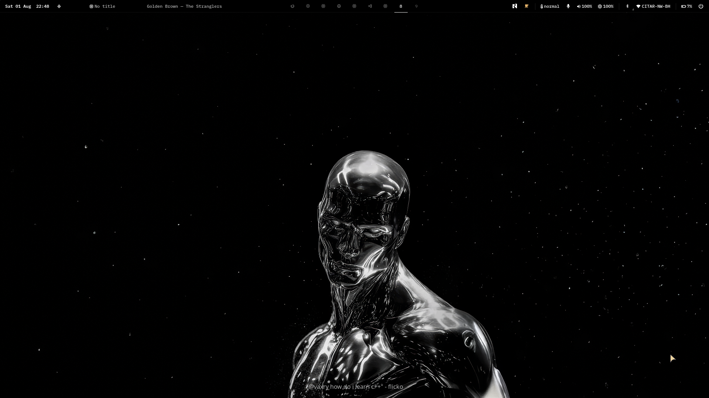
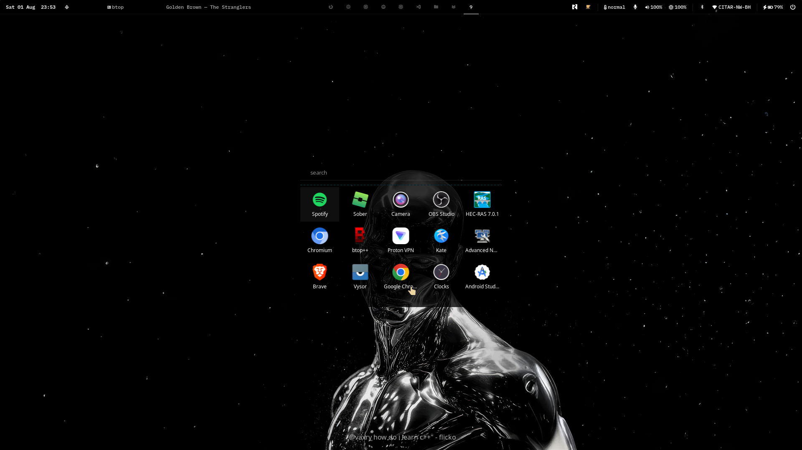
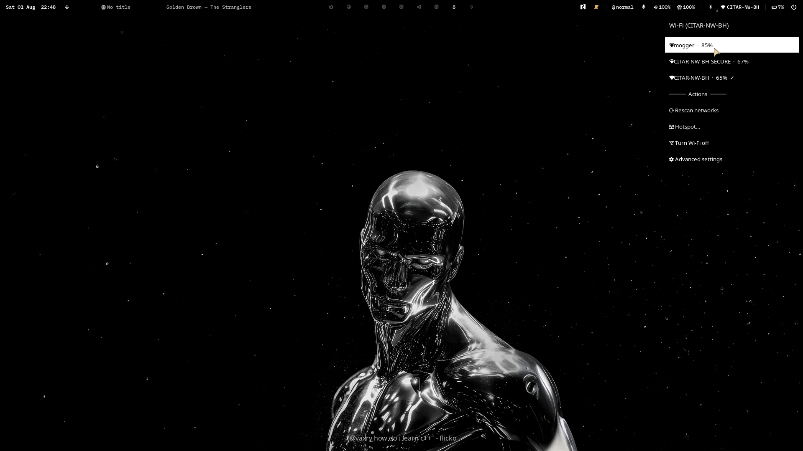
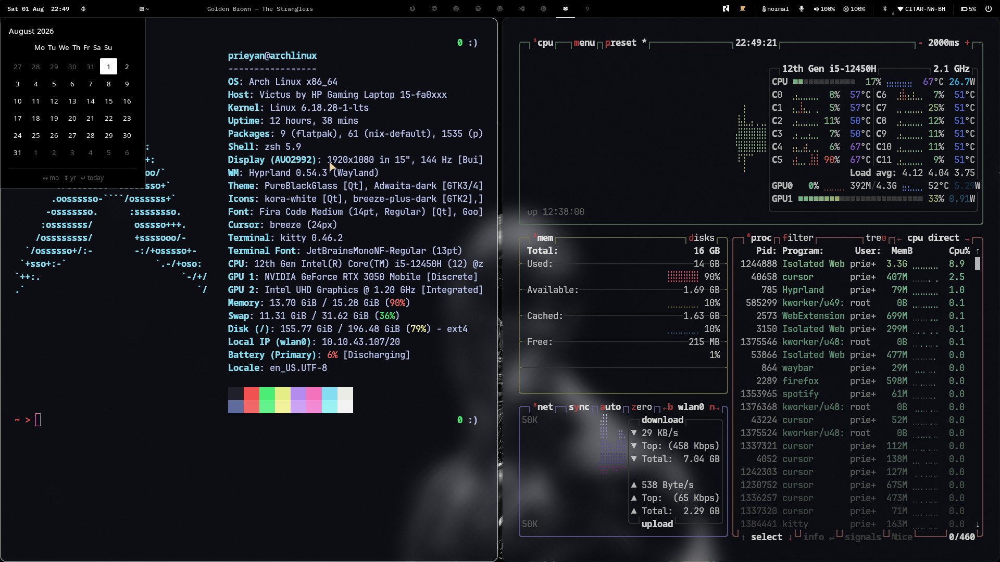
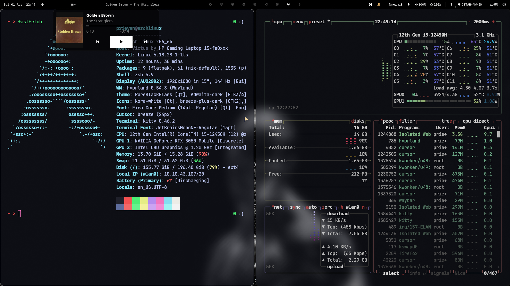

<div align="center">

# VerumDot

**Truth in black. Nothing else.**

*A Hyprland rice built on absolute contrast — ink-void panels, frosted glass, white type.
No accent rainbow. No noise. Just signal.*

<br/>



<br/>

`Hyprland` · `Waybar` · `Rofi` · `eww` · `Kitty` · `hyprlock` · `PureBlackGlass`

</div>

---

## Philosophy

VerumDot strips the desktop down to what actually matters: **readability, speed, and presence**.

Black is the canvas. White is the ink. Glass is the depth — wallpaper bleeding through translucent bars, menus, and windows so the machine feels like one surface instead of a stack of chrome boxes. Every dropdown, lock screen, and tile follows the same grammar: sharp edges of meaning, soft edges of light.

Portable by design. One command and VerumDot is yours — no username baked in, no scavenger hunt across `~/.config`.

---

## Gallery

<p align="center">
  
  <br/><sub>Desktop — Waybar, wallpaper, Spotify now-playing</sub>
</p>

<p align="center">
  
  <br/><sub>App launcher — Rofi grid over the glass desktop</sub>
</p>

<table>
  <tr>
    <td width="50%" align="center">
      <br/>
      <sub>Wi-Fi menu</sub>
    </td>
    <td width="50%" align="center">
      <br/>
      <sub>Calendar popup</sub>
    </td>
  </tr>
  <tr>
    <td colspan="2" align="center">
      <br/>
      <sub>Spotify widget · Kitty · btop — translucent tiling</sub>
    </td>
  </tr>
</table>

---

## Overview

VerumDot is a complete Arch + Hyprland environment: dark glass UI, white typography, zero decorative clutter. One folder. One installer. Everything speaks the same language.

| Layer | What you get |
|-------|----------------|
| **Compositor** | Hyprland — blur, rounding, opacity, lid/suspend tuned |
| **Bar** | Waybar — clock, Spotify, workspaces, mic/vol/brightness, Wi-Fi, Bluetooth, battery, power |
| **Menus** | Rofi — launcher, Wi-Fi, Bluetooth, power, wallpapers, Spotify card |
| **Panels** | eww — volume, power, calendar |
| **Lock / idle** | hyprlock + hypridle |
| **Theme** | PureBlackGlass (Kvantum) + matching GTK / portal |
| **Apps** | Kitty, mako, hyprpaper, Firefox, Nautilus |

---

## Quick start

**Requirements:** Arch Linux (or derivative) · `pacman` · a working internet connection

### One command, fresh machine

```bash
bash <(curl -fsSL https://github.com/PRIEYAN/VerumDot/raw/main/install.sh)
```

That clones the rice, installs every dependency, and deploys the config. Nothing
else to fetch, nothing to symlink by hand.

### From a clone

```bash
git clone https://github.com/PRIEYAN/VerumDot.git
cd VerumDot && ./setup.sh
```

### The installer

`setup.sh` opens an interactive wizard. It reads the machine first — distro, AUR
helper, GPU, battery, connected outputs, existing config — then asks what to do
with it. Arrow keys move, space toggles, enter confirms; every question has a
default, so holding enter is a valid answer.

| It asks | It does |
|---------|---------|
| Full / config-only / packages-only | scopes the run |
| Which package groups | audio, capture, network, power, theming, fonts, apps, AUR |
| Terminal · browser · file manager · editor | installs your picks and rewrites the binds in `hypr.conf` |
| Which output, which scale | writes the real `monitor =` line — no more editing `eDP-1` by hand |
| Wallpaper folder | creates it, seeds a placeholder, links `current-wallpaper` |
| Theme · services · lid policy | PureBlackGlass, pipewire, lock-don't-suspend |

Then it prints the full plan and waits for a yes before touching anything.
Everything it replaces is backed up as `<path>.bak.<timestamp>` — nothing is
deleted — and the whole run is logged to `~/.cache/verumdot-install-*.log`.

### Flags

```bash
./setup.sh              # interactive wizard
./setup.sh --auto       # zero questions, everything, sane defaults
./setup.sh --packages   # dependencies only
./setup.sh --config     # config + theme only
./setup.sh --dry-run    # print the plan, change nothing
./setup.sh --no-anim    # skip the intro animation
./setup.sh --help
```

Flags pass through the bootstrap too:

```bash
bash <(curl -fsSL https://github.com/PRIEYAN/VerumDot/raw/main/install.sh) --auto
```

### After install

1. Drop wallpapers into `~/Pictures/Wallpapers/`
2. Log out, pick the **Hyprland** session, log back in
3. Reload anytime: `hyprctl reload`

If you skipped the output question, set yours in `~/.config/hypr/hypr.conf`
(`hyprctl monitors` lists them).

### Migrate

```bash
./setup.sh          # full
./setup.sh --config # if packages are already installed
```

Live config always lands at `~/.config/hypr`.

---

## Keybinds

| Bind | Action |
|------|--------|
| `SUPER` + `Return` / `T` | Terminal (Kitty) |
| `SUPER` + `Space` / `R` | App launcher |
| `SUPER` + `W` | Firefox |
| `SUPER` + `E` | Files |
| `SUPER` + `C` | VS Code |
| `SUPER` + `L` | Lock |
| `SUPER` + `Q` | Kill window |
| `SUPER` + `F` | Fullscreen |
| `SUPER` + `1`–`0` | Workspaces |
| `SUPER` + `Shift` + `W` | Wallpaper picker |
| `Print` | Full screenshot |
| `Shift` + `Print` | Region screenshot |

Screenshots → `~/Pictures/Screenshots` (+ clipboard).

---

## Tree

```
VerumDot/
├── install.sh            # one-command bootstrap (clone + setup)
├── setup.sh              # interactive installer
├── packages.txt          # pacman + AUR manifest
├── hyprland.conf         # entry → ./hypr.conf
├── hypr.conf             # binds, blur, rules
├── screenshots/          # gallery assets
├── scripts/
│   ├── _paths.sh         # portable roots
│   ├── wallpaper.sh
│   ├── screenshot.sh
│   └── theme-install.sh
└── apps/
    ├── waybar/           # bar + scripts
    ├── rofi/             # launcher & menus
    ├── eww/              # panels
    ├── hyprlock/
    ├── hypridle/
    ├── kitty/
    ├── mako/
    └── theme/            # PureBlackGlass
```

---

## Details

- **Wallpapers** — `~/Pictures/Wallpapers/`; active image is symlinked as `current-wallpaper` for hyprlock
- **Theme refresh** — `~/.config/hypr/scripts/theme-install.sh`
- **Glass Spotify** — window opacity rule in `hypr.conf`; center widget via Waybar click
- **NVIDIA / lid** — comments in `hypr.conf` and `apps/hypridle/hypridle.conf`

---

<div align="center">

**VerumDot** — where the desktop stops arguing with itself.

</div>
