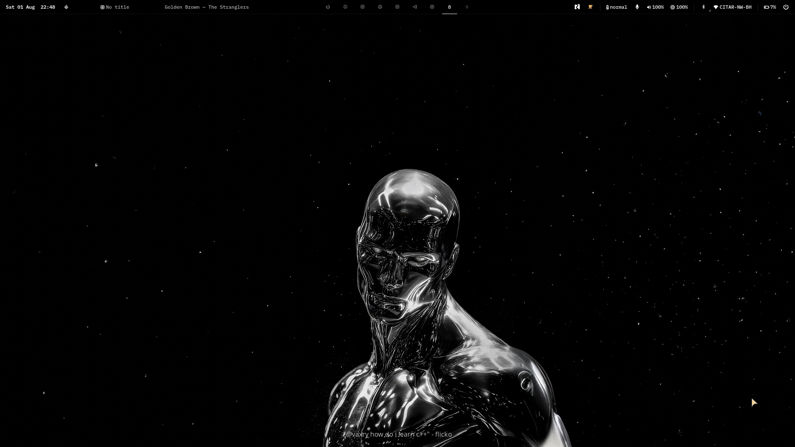
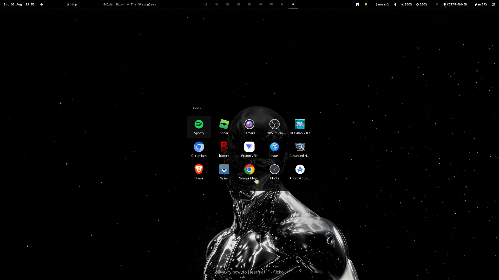
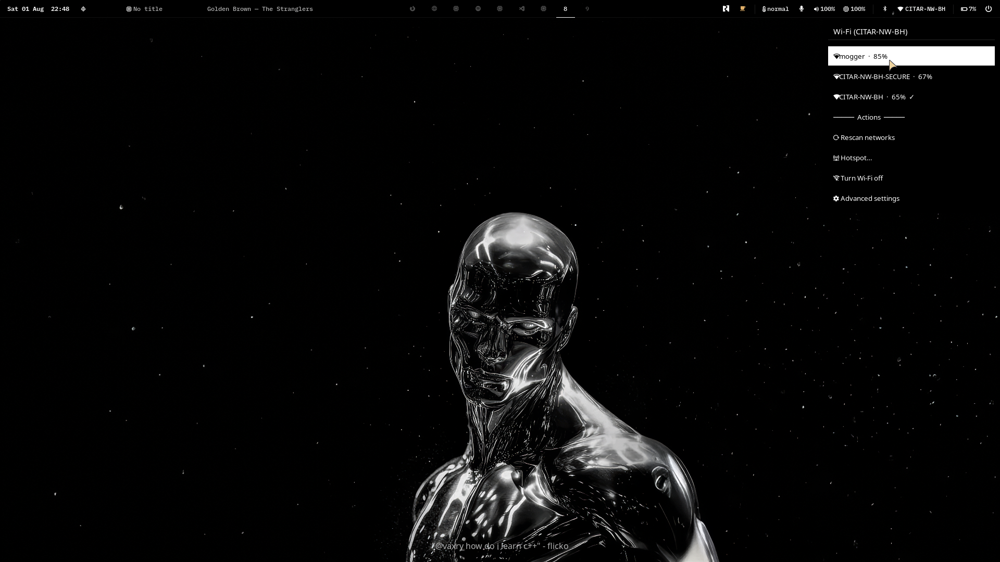
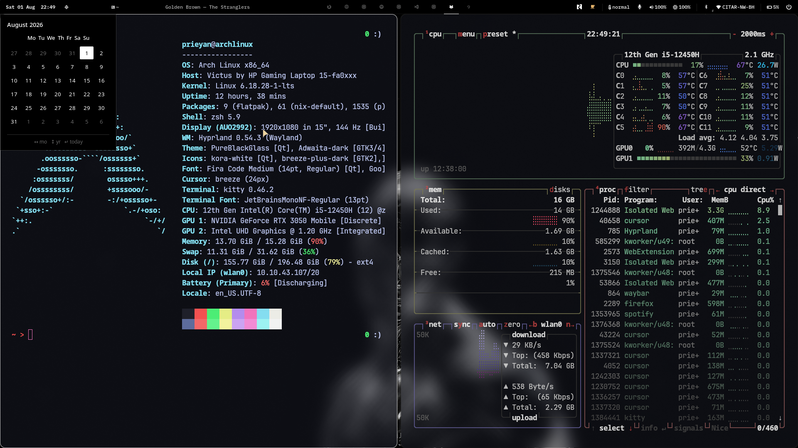
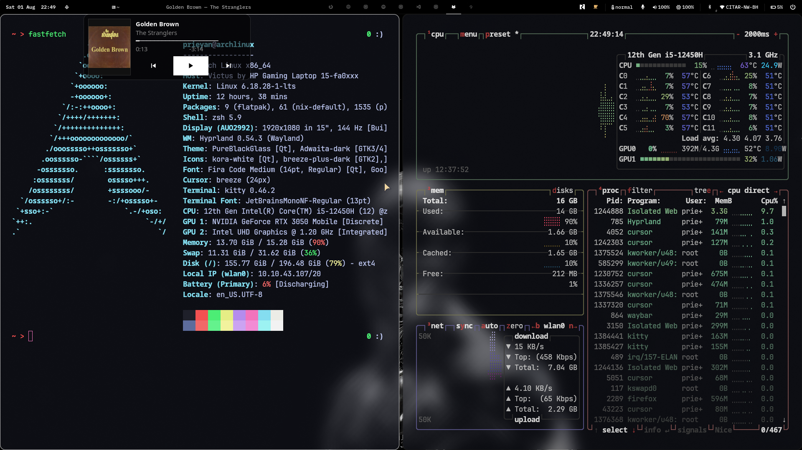

<div align="center">

# VerumDot

**Truth in black. Nothing else.**

*A pure-black **Hyprland rice** for Arch Linux — ink-void panels, frosted glass, white type.
No accent rainbow. No noise. Just signal.*

<br/>

[](https://github.com/PRIEYAN/VerumDot/stargazers)
[](LICENSE)
[](https://hyprland.org)
[](https://archlinux.org)
[](CONTRIBUTING.md)



<br/>

`Hyprland` · `Waybar` · `Rofi` · `Kitty` · `hyprlock` · `mako` · `PureBlackGlass`

**One command installs the whole desktop.**

```bash
bash <(curl -fsSL https://github.com/PRIEYAN/VerumDot/raw/main/install.sh)
```

<sub>⭐ If VerumDot makes your desktop better, a star helps other people find it.</sub>

</div>

---

## Philosophy

VerumDot strips the desktop down to what actually matters: **readability, speed, and presence**.

Black is the canvas. White is the ink. Glass is the depth — wallpaper bleeding through translucent bars, menus, and windows so the machine feels like one surface instead of a stack of chrome boxes. Every dropdown, lock screen, and tile follows the same grammar: sharp edges of meaning, soft edges of light.

Portable by design. One command and VerumDot is yours — no username baked in, no scavenger hunt across `~/.config`.

---

## Gallery

<p align="center">
  
  <br/><sub>Desktop — Waybar, wallpaper, Spotify now-playing</sub>
</p>

<p align="center">
  
  <br/><sub>App launcher — Rofi grid over the glass desktop</sub>
</p>

<table>
  <tr>
    <td width="50%" align="center">
      <br/>
      <sub>Wi-Fi menu</sub>
    </td>
    <td width="50%" align="center">
      <br/>
      <sub>Calendar popup</sub>
    </td>
  </tr>
  <tr>
    <td colspan="2" align="center">
      <br/>
      <sub>Spotify widget · Kitty · btop — translucent tiling</sub>
    </td>
  </tr>
</table>

---

## Why VerumDot

Most rices hand you a color scheme. VerumDot hands you a finished laptop.

- 🖤 **Actually pure black** — `#000000`, not "very dark grey." Perfect on OLED, honest on IPS.
- 🧙 **An installer that asks first** — reads your distro, GPU, battery and monitors, then shows the full plan and waits for a yes. Backs up everything it touches.
- 🔀 **Swap your stack at install time** — pick your terminal, browser, file manager and editor; the wizard rewrites the keybinds for you.
- 🪟 **No username baked in** — every path resolves through `scripts/_paths.sh`. Clone it anywhere, as anyone.
- 🌡️ **Eye comfort mode** — one click for a 3000K warm tint, through the compositor (`hyprsunset`), so it actually sticks on Wayland.
- ⚡ **Three-way performance toggle** — `SUPER + P` cycles performance → battery → normal across the CPU governor.
- 🔆 **Shader brightness boost** — push the panel past 100% with a GLSL shader when the sun wins.
- 👆 **Gesture-driven** — 3-finger swipe for workspaces, 4-finger up for a hidden scratchpad workspace.
- 🔋 **Laptop-literate** — battery alerts at 20/15%, lid-close locks instead of suspending, NVIDIA suspend fix included.
- 🔕 **Do-not-disturb** — `SUPER + CTRL + N`, straight into mako.
- 🎵 **Spotify, glassed** — a translucent now-playing card in the bar and a live quickshell dropdown on click.
- 🎛️ **Control centre** — throw the pointer at the top-right corner and a frosted panel slides in: brightness and volume sliders, power mode, mic, stay-awake. The Wi-Fi and Bluetooth tiles toggle from their icon and open network/device lists in place.
- 🖼️ **Two wallpaper pickers** — one for the desktop, one for the lock screen, both Rofi.

---

## Overview

VerumDot is a complete Arch + Hyprland environment: dark glass UI, white typography, zero decorative clutter. One folder. One installer. Everything speaks the same language.

| Layer | What you get |
|-------|----------------|
| **Compositor** | Hyprland — blur, rounding, opacity, gestures, lid/suspend tuned |
| **Bar** | Waybar — clock, Spotify, workspaces, mic/vol/brightness, battery, power |
| **Menus** | Quickshell — app launcher, control centre (Wi-Fi, Bluetooth), Spotify card · Rofi — power, volume, brightness, calendar, wallpapers |
| **Notifications** | mako — with do-not-disturb and low-battery alerts |
| **Lock / idle** | hyprlock + hypridle |
| **Editor** | Neovim — VS Code layout: explorer rail, tabs, docked terminal, glass panes |
| **Theme** | PureBlackGlass (Kvantum) + matching GTK / Qt / portal |
| **Apps** | Kitty, hyprpaper, Firefox, Nautilus |

> **Note:** the `apps/eww` panels are legacy — Rofi versions replaced them. They ship for reference and are off by default.

---

## Quick start

**Requirements:** Arch Linux (or derivative) · `pacman` · a working internet connection

### One command, fresh machine

```bash
bash <(curl -fsSL https://github.com/PRIEYAN/VerumDot/raw/main/install.sh)
```

That clones the rice, installs every dependency, and deploys the config. Nothing
else to fetch, nothing to symlink by hand.

### From a clone

```bash
git clone https://github.com/PRIEYAN/VerumDot.git
cd VerumDot && ./setup.sh
```

### The installer

`setup.sh` opens an interactive wizard. It reads the machine first — distro, AUR
helper, GPU, battery, connected outputs, existing config — then asks what to do
with it. Arrow keys move, space toggles, enter confirms; every question has a
default, so holding enter is a valid answer.

| It asks | It does |
|---------|---------|
| Full / config-only / packages-only | scopes the run |
| Which package groups | audio, capture, network, power, theming, fonts, apps, AUR |
| Terminal · browser · file manager · editor | installs your picks and rewrites the binds in `hypr.conf` |
| Which output, which scale | writes the real `monitor =` line — no more editing `eDP-1` by hand |
| Wallpaper folder | creates it, seeds a placeholder, links `current-wallpaper` |
| Theme · services · lid policy | PureBlackGlass, pipewire, lock-don't-suspend |

Then it prints the full plan and waits for a yes before touching anything.
Everything it replaces is backed up as `<path>.bak.<timestamp>` — nothing is
deleted — and the whole run is logged to `~/.cache/verumdot-install-*.log`.

### Flags

```bash
./setup.sh              # interactive wizard
./setup.sh --auto       # zero questions, everything, sane defaults
./setup.sh --packages   # dependencies only
./setup.sh --config     # config + theme only
./setup.sh --dry-run    # print the plan, change nothing
./setup.sh --no-anim    # skip the intro animation
./setup.sh --help
```

Flags pass through the bootstrap too:

```bash
bash <(curl -fsSL https://github.com/PRIEYAN/VerumDot/raw/main/install.sh) --auto
```

### After install

1. Drop wallpapers into `~/Pictures/Wallpapers/`
2. Log out, pick the **Hyprland** session, log back in
3. Reload anytime: `hyprctl reload`

If you skipped the output question, set yours in `~/.config/hypr/hypr.conf`
(`hyprctl monitors` lists them).

### Migrate

```bash
./setup.sh          # full
./setup.sh --config # if packages are already installed
```

Live config always lands at `~/.config/hypr`.

---

## Keybinds

### Launch

| Bind | Action |
|------|--------|
| `SUPER` + `Return` / `T` | Terminal (Kitty) |
| `SUPER` + `Space` / `R` | App launcher |
| `SUPER` + `W` | Browser (Firefox) |
| `SUPER` + `E` | Files (Nautilus) |
| `SUPER` + `C` | Editor (VS Code) |
| `SUPER` + `L` | Lock screen |
| `XF86PowerOff` | Power menu |

### Windows

| Bind | Action |
|------|--------|
| `SUPER` + `Q` | Kill window |
| `SUPER` + `F` | Fullscreen |
| `SUPER` + `Tab` / `Shift` + `Tab` | Focus next / previous |
| `SUPER` + drag `LMB` / `RMB` | Move / resize |

### Workspaces

| Bind | Action |
|------|--------|
| `SUPER` + `1`–`0` | Switch workspace |
| `SUPER` + `CTRL` + `SHIFT` + `1`–`0` | Move window to workspace |
| `SUPER` + `CTRL` + `←` / `→` | Previous / next workspace |
| `SUPER` + scroll | Cycle workspaces |
| `SUPER` + `CTRL` + `SHIFT` + `↑` / `↓` | Open / close hidden workspace |
| `SUPER` + `CTRL` + `SHIFT` + `R` | Reload Hyprland |

### System

| Bind | Action |
|------|--------|
| `SUPER` + `P` | Performance mode (performance → battery → normal) |
| `SUPER` + `SHIFT` + `W` | Wallpaper picker |
| `SUPER` + `CTRL` + `SHIFT` + `W` | Lock-screen wallpaper picker |
| `SUPER` + `N` | Dismiss notification |
| `SUPER` + `SHIFT` + `N` | Dismiss all |
| `SUPER` + `CTRL` + `N` | Toggle do-not-disturb |
| `Print` | Full screenshot |
| `SHIFT` + `Print` | Region screenshot |
| Brightness / volume keys | Adjust (volume boosts to 150%) |

### Editor (Neovim)

Applies inside Neovim once the overlay is deployed — see [`apps/nvim/`](apps/nvim/).

| Bind | Action |
|------|--------|
| `CTRL` + `SHIFT` + `` ` `` | Toggle the terminal dock (also `CTRL` + `` ` ``) |
| `CTRL` + `B` | Toggle the explorer rail |
| `SPACE` + `e` | Focus the explorer |
| `SPACE` + `tt` | Toggle the terminal dock |
| `Esc` `Esc` | Leave terminal mode |

### Gestures

| Gesture | Action |
|---------|--------|
| 3-finger swipe ←→ | Change workspace |
| 4-finger swipe ↑ | Open hidden workspace (from workspace 1) |
| 4-finger swipe ↓ | Close hidden workspace |

Screenshots → `~/Pictures/Screenshots` (+ clipboard).

---

## Tree

```
VerumDot/
├── install.sh            # one-command bootstrap (clone + setup)
├── setup.sh              # interactive installer
├── packages.txt          # pacman + AUR manifest
├── hyprland.conf         # entry → ./hypr.conf
├── hypr.conf             # binds, blur, rules, gestures
├── shaders/              # GLSL brightness boost
├── screenshots/          # gallery assets
├── scripts/
│   ├── _paths.sh         # portable roots
│   ├── wallpaper.sh
│   ├── screenshot.sh
│   ├── battery-alert.sh
│   └── theme-install.sh
└── apps/
    ├── waybar/           # bar + module scripts
    ├── rofi/             # launcher & menus
    ├── hyprlock/
    ├── hypridle/
    ├── kitty/
    ├── nvim/             # VS Code layout overlay (glass panes)
    ├── mako/
    ├── eww/              # legacy panels
    └── theme/            # PureBlackGlass
```

---

## Details

- **Wallpapers** — `~/Pictures/Wallpapers/`; active image is symlinked as `current-wallpaper` for hyprlock
- **Theme refresh** — `~/.config/hypr/scripts/theme-install.sh`
- **Neovim glass** — the panes are painted by `apps/nvim/lua/verum/palette.lua` and made see-through by `transparent_background_colors` in `apps/kitty/kitty.conf`; the two lists must match, or a pane goes opaque. `setup.sh --no-nvim` skips the overlay entirely
- **Glass Spotify** — window opacity rule in `hypr.conf`; quickshell dropdown via Waybar click
- **NVIDIA / lid** — comments in `hypr.conf` and `apps/hypridle/hypridle.conf`
- **Eye comfort** — needs `hyprsunset`; the toggle manages the daemon directly (see the note in `apps/waybar/scripts/eye-comfort-toggle.sh` for why not redshift)
- **Performance mode** — needs `cpupower` for governor switching; degrades quietly without it

---

## Contributing

Issues and PRs welcome — read [CONTRIBUTING.md](CONTRIBUTING.md) first. The
short version: pure black, white type, no accent colors, portable paths, and
new menus go through Rofi.

Running VerumDot? Post a screenshot in
[Discussions](https://github.com/PRIEYAN/VerumDot/discussions) — I want to see
what you did with it.

## License

[MIT](LICENSE) — take it, fork it, make it yours.

---

<div align="center">

**VerumDot** — where the desktop stops arguing with itself.

<sub>If this saved you a weekend of config editing, leave a ⭐</sub>

</div>
